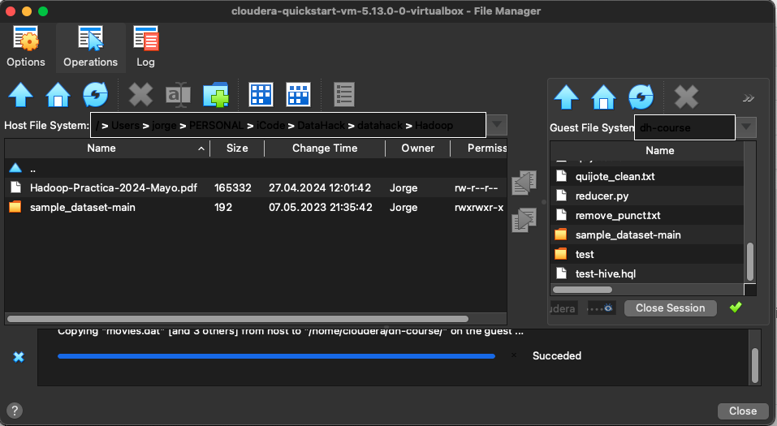
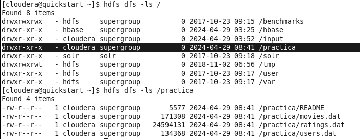

PRÁCTICA HADOOP

# Ejercicio 1

## IMPORTACIÓN DATASETS
- DESCARGA DATASETS
    > Repositorio: https://github.com/dgarciaesc/sample_dataset

- IMPORTACIÓN DATASETS A VIRTUALBOX/CLOUDERA
    > Con la herramienta 'File Manager' (menú 'Machine' -> Usuario=cloudera, Password=cloudera)

- COMPROBAR DESCARGA Y CAMBIAR PERMISOS:
    $ ls /home/cloudera/dh-course/dataset_practica/
    $ chmod 777 movies.dat
    > cambiar en todos los datasets

## MSQL
- CREAR DATABASE + TABLAS + CARGAR DATOS:
    $ mysql -uroot -pcloudera
    $ CREATE DATABASE practica_hadoop;
    $ CREATE TABLE movies (MovieID INT PRIMARY KEY, Title VARCHAR(255), Genres VARCHAR(255));
    $ LOAD DATA LOCAL INFILE '/home/cloudera/dh-course/dataset_practica/movies.dat' INTO TABLE movies FIELDS TERMINATED BY '::' LINES TERMINATED BY '\n';
    $ select * from movies limit 5; -> Comprobar importación

