PRÁCTICA HADOOP

## EJERCICIO 1

**IMPORTACIÓN DATASETS**

1. DESCARGA DATASETS
    - Repositorio: https://github.com/dgarciaesc/sample_dataset
    - Code/Download ZIP + descomprimir

2. IMPORTACIÓN DATASETS A VIRTUALBOX/CLOUDERA
    - Con la herramienta 'File Manager' de VirtualBox desde menú 'Machine'
    > Usuario = cloudera, Password = cloudera

    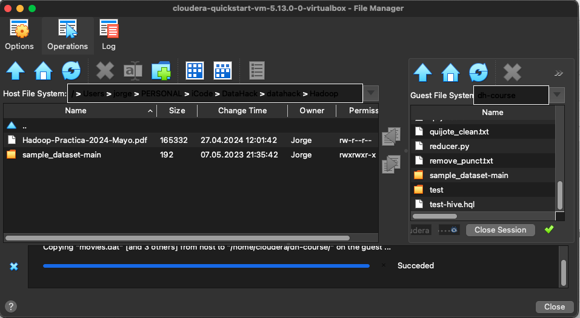

3. COMPROBAR DESCARGA Y CAMBIAR PERMISOS:
    - $ ls /home/cloudera/dh-course/sample_dataset-main/
    - $ chmod 777 movies.dat
    > cambiar en todos los datasets

    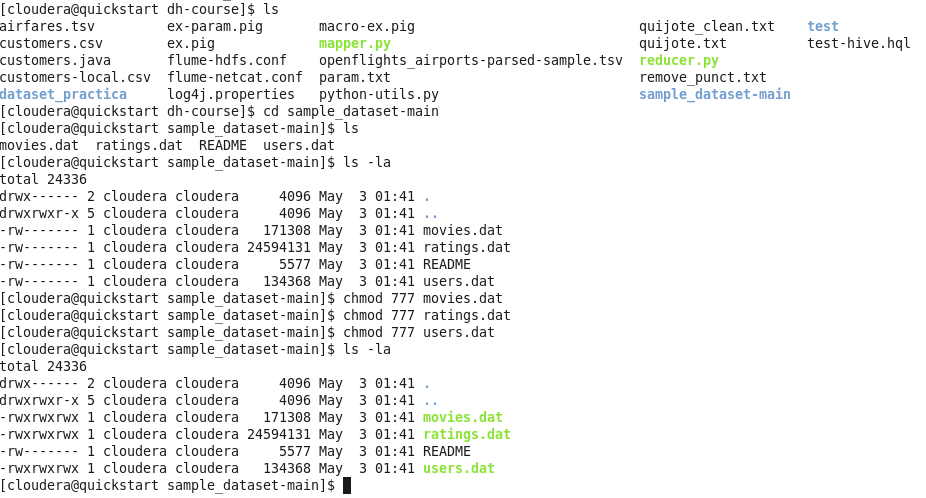

**MSQL**

1. CREAR DATABASE + TABLAS + CARGAR DATOS:
    - $ mysql -uroot -pcloudera
    - $ show databases;
    - $ CREATE DATABASE practica_hadoop;
    - $ use practica_hadoop;

    - $ CREATE TABLE movies (MovieID INT PRIMARY KEY, Title VARCHAR(255), Genres VARCHAR(255));
    - $ LOAD DATA LOCAL INFILE '/home/cloudera/dh-course/sample_dataset-main/movies.dat'
        INTO TABLE movies
        FIELDS TERMINATED BY '::'
        LINES TERMINATED BY '\n';
    - $ select * from movies limit 5; -> Comprobar importación

    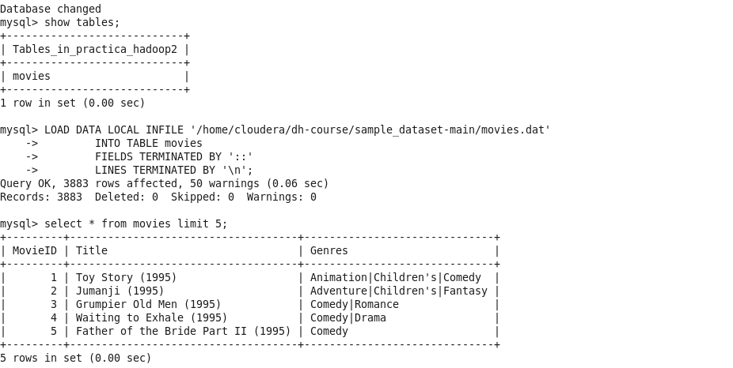

    - $ CREATE TABLE users (UserID INT PRIMARY KEY, Gender CHAR(1), Age INT, Occupation INT, ZipCode VARCHAR(10));
    - $ LOAD DATA LOCAL INFILE '/home/cloudera/dh-course/sample_dataset-main/users.dat'
        INTO TABLE users
        FIELDS TERMINATED BY '::'
        LINES TERMINATED BY '\n';

    - $ CREATE TABLE ratings (UserID INT, MovieID INT, Rating INT, Timestamp INT,
        FOREIGN KEY (UserID) REFERENCES users(UserID),
        FOREIGN KEY (MovieID) REFERENCES movies(MovieID));
    - $ LOAD DATA LOCAL INFILE '/home/cloudera/dh-course/sample_dataset-main/ratings.dat'
        INTO TABLE ratings
        FIELDS TERMINATED BY '::'
        LINES TERMINATED BY '\n';

    - $ CREATE TABLE occupations (OccupationID INT PRIMARY KEY, OccupationName VARCHAR(255));
    - $ INSERT INTO occupations (OccupationID, OccupationName) VALUES
        (0, 'other or not specified'),
        (1, 'academic/educator'),
        (2, 'artist'),
        (3, 'clerical/admin'),
        (4, 'college/grad student'),
        (5, 'customer service'),
        (6, 'doctor/health care'),
        (7, 'executive/managerial'),
        (8, 'farmer'),
        (9, 'homemaker'),
        (10, 'K-12 student'),
        (11, 'lawyer'),
        (12, 'programmer'),
        (13, 'retired'),
        (14, 'sales/marketing'),
        (15, 'scientist'),
        (16, 'self-employed'),
        (17, 'technician/engineer'),
        (18, 'tradesman/craftsman'),
        (19, 'unemployed'),
        (20, 'writer');

**CONSULTAS MYSQL**

1. Película con más opiniones:
    - $ SELECT m.MovieID, m.Title,
        COUNT(r.MovieID) AS num_opiniones FROM movies m
        JOIN ratings r ON m.MovieID = r.MovieID
        GROUP BY m.MovieID, m.Title
        ORDER BY num_opiniones DESC LIMIT 1;

    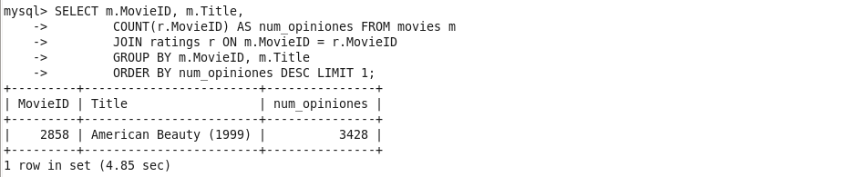

2. Los 10 usuarios más activos a la hora de puntuar películas:
    - $ SELECT UserID, COUNT(*) AS num_calificaciones FROM ratings
        GROUP BY UserID
        ORDER BY num_calificaciones DESC
        LIMIT 10;

    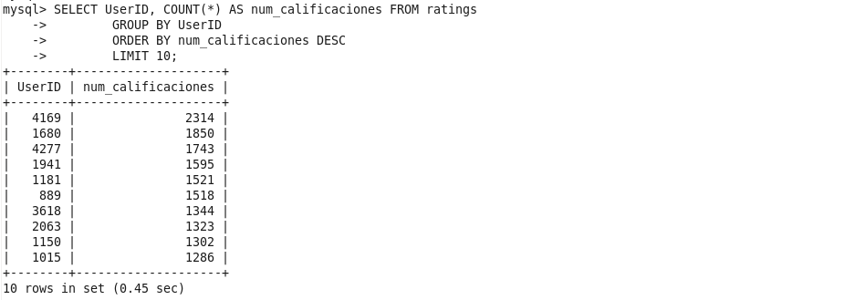

3. Las tres mejores películas según las calificaciones:
    - $ SELECT m.MovieID, m.Title, AVG(r.Rating) AS avg_rating FROM movies m
        JOIN ratings r ON m.MovieID = r.MovieID
        GROUP BY m.MovieID, m.Title
        ORDER BY avg_rating DESC
        LIMIT 3;
    
    

4. Profesiones en las que deberíamos enfocar nuestros esfuerzos en publicidad:
    - Profesión que más calificaciones hace:
    - $ SELECT o.OccupationName, COUNT(*) AS num_calificaciones
        FROM users u
        JOIN ratings r ON u.UserID = r.UserID
        JOIN occupations o ON u.Occupation = o.OccupationID
        GROUP BY o.OccupationName
        ORDER BY num_calificaciones DESC
        LIMIT 1;

    

**SQOOP**

- IMPORTACIÓN DE MYSQL A HDFS:
    - $ sqoop import-all-tables --connect jdbc:mysql://localhost/practica_hadoop --username root --password cloudera --table movies --warehouse-dir /hdfs-practica-hadoop

    > Si no importa todas las tablas, cambiar a 'import' y añadir --table nombre_tabla al importar.
     - --warehouse, Sqoop crea subdirectorios dentro del directorio raíz para cada tabla importada, lo que ayuda a mantener una estructura organizada en HDFS.
     - -—num-mappers: expecificar nº si queremos mejorar rendimiento. Se crea 1 por defecto si no se especifica nada.
     - --split-by se utiliza para especificar la columna por la cual se debe dividir la importación de datos en mappers.

    - Importación de tabla ratings (al no tener Primary Key debe importarse con 'split-by'):
        - $ sqoop import --connect jdbc:mysql://localhost/practica_hadoop --username root --password cloudera --table ratings --target-dir /hdfs-practica-hadoop/ratings --split-by UserID

        
        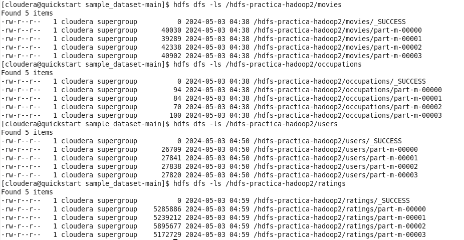

    - Se crearán archivos .java en la carpeta de los datasets

        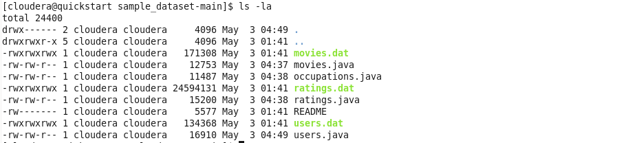

**HIVE**

- CREAR BASE DE DATOS Y TABLAS:
    - $ hive
    - $ CREATE DATABASE practica_hadoop;
    - $ show databases;
    - $ use practica_hadoop;

    - $ CREATE EXTERNAL TABLE movies (MovieID INT, Title STRING, Genres STRING)
        ROW FORMAT DELIMITED
        FIELDS TERMINATED BY ','
        LINES TERMINATED BY '\n'
        LOCATION '/hdfs-practica-hadoop/movies';

    - $ CREATE EXTERNAL TABLE users (UserID INT, Gender STRING, Age INT, Occupation INT, zip_code STRING)
        ROW FORMAT DELIMITED
        FIELDS TERMINATED BY ','
        LINES TERMINATED BY '\n'
        LOCATION '/hdfs-practica-hadoop2/users';

    - $ CREATE EXTERNAL TABLE ratings (UserID INT, MovieID INT, Rating INT, Timestamp INT)
        ROW FORMAT DELIMITED
        FIELDS TERMINATED BY ','
        LINES TERMINATED BY '\n'
        LOCATION '/hdfs-practica-hadoop2/ratings';

    - $ CREATE EXTERNAL TABLE occupations (OccupationID INT, OccupationName STRING)
        ROW FORMAT DELIMITED
        FIELDS TERMINATED BY ','
        LINES TERMINATED BY '\n'
        LOCATION '/hdfs-practica-hadoop2/occupations';

    > Hive no usa 'primary keys' ni 'foreing key' y los 'varchar' pueden ser 'string'

    

**CONSULTAS HIVE**

1. Película con más opiniones:
    - $ SELECT m.MovieID, m.Title,
        COUNT(r.MovieID) AS num_opiniones FROM movies m
        JOIN ratings r ON m.MovieID = r.MovieID
        GROUP BY m.MovieID, m.Title
        ORDER BY num_opiniones DESC LIMIT 1;

    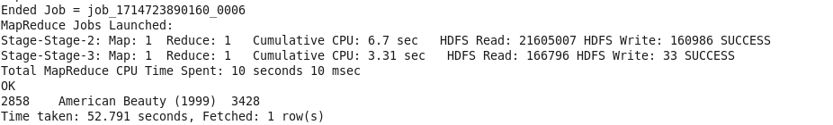

2. Los 10 usuarios más activos a la hora de puntuar películas:
    - $ SELECT UserID, COUNT(*) AS num_calificaciones FROM ratings
        GROUP BY UserID
        ORDER BY num_calificaciones DESC
        LIMIT 10;

    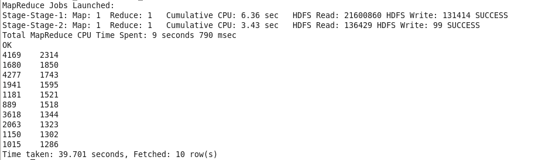

3. Las tres mejores películas según los scores:
    - $ SELECT m.MovieID, m.Title, AVG(r.Rating) AS avg_rating FROM movies m
        JOIN ratings r ON m.MovieID = r.MovieID
        GROUP BY m.MovieID, m.Title
        ORDER BY avg_rating DESC
        LIMIT 3;

    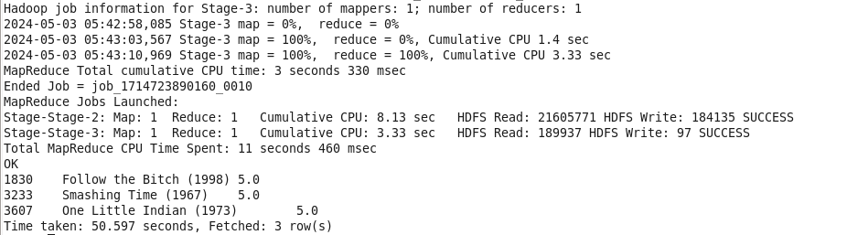

4. Profesiones en las que deberíamos enfocar nuestros esfuerzos en publicidad:
    - Profesión que más calificaciones hace:
    - $ SELECT o.OccupationName, COUNT(*) AS num_calificaciones
        FROM users u
        JOIN ratings r ON u.UserID = r.UserID
        JOIN occupations o ON u.Occupation = o.OccupationID
        GROUP BY o.OccupationName
        ORDER BY num_calificaciones DESC
        LIMIT 1;
    
    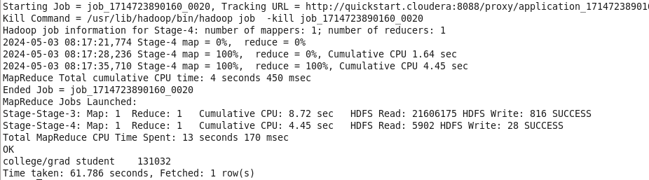

5. Otros insight valiosos que pudiéramos extraer de los datos procesados:

    - Analisis de las preferencias de género cinematográfico de los usuarios para diferentes tipos de películas calculando el promedio de calificaciones de distintos géneros y cómo difieren las preferencias entre hombres y mujeres.

        - $ SELECT m.Genres,
            AVG(CASE WHEN u.Gender = 'M' THEN r.Rating END) AS Male_Average_Rating,
            AVG(CASE WHEN u.Gender = 'F' THEN r.Rating END) AS Female_Average_Rating
            FROM ratings r JOIN movies m ON r.MovieID = m.MovieID
            JOIN users u ON r.UserID = u.UserID
            GROUP BY m.Genres;

    - Análisis evolución dcomportamiento de los usuarios analizando si hay tendencias estacionales en la cantidad de calificaciones o en los géneros de películas más populares en diferentes momentos del año.

        - $ SELECT
            MONTH(FROM_UNIXTIME(r.Timestamp)) AS Month,
            YEAR(FROM_UNIXTIME(r.Timestamp)) AS Year,
            COUNT(*) AS Total_Ratings,
            AVG(r.Rating) AS Average_Rating FROM ratings r
            GROUP BY MONTH(FROM_UNIXTIME(r.Timestamp)), YEAR(FROM_UNIXTIME(r.Timestamp))
            ORDER BY Year, Month;

    - Análisis de la participación del usuario mediante el número total de calificaciones y el promedio de calificaciones para cada grupo de edad, género y ocupación.

        - $ SELECT u.Age AS Age_Group, u.Gender AS Gender, o.OccupationName AS Occupation,
            COUNT(*) AS Total_Ratings,
            AVG(r.Rating) AS Average_Rating
            FROM ratings r JOIN users u ON r.UserID = u.UserID JOIN occupations o ON u.Occupation = o.OccupationID
            GROUP BY u.Age, u.Gender, o.OccupationName
            ORDER BY Total_Ratings DESC;

**HUE**

- Las consultas también pueden realizarse con la interfaz gráfica de Haddop 'HUE'

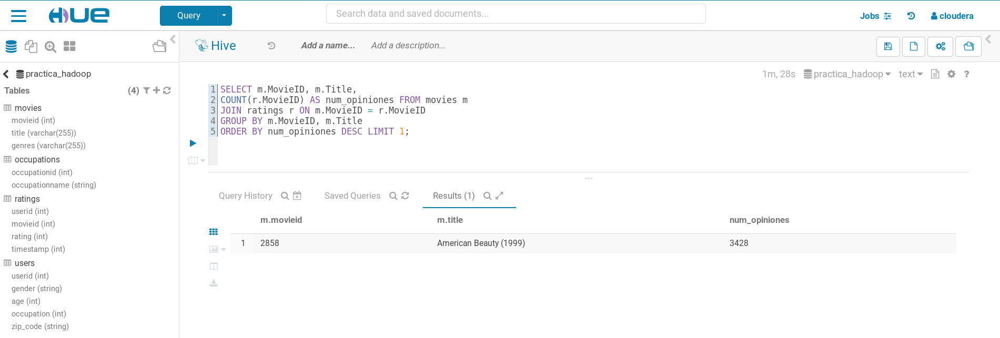
