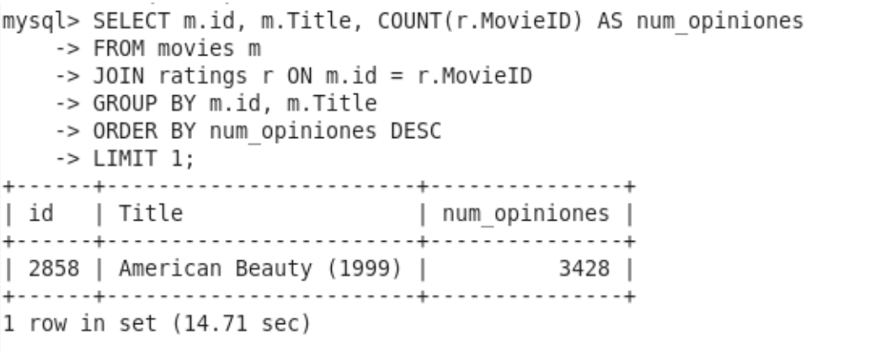
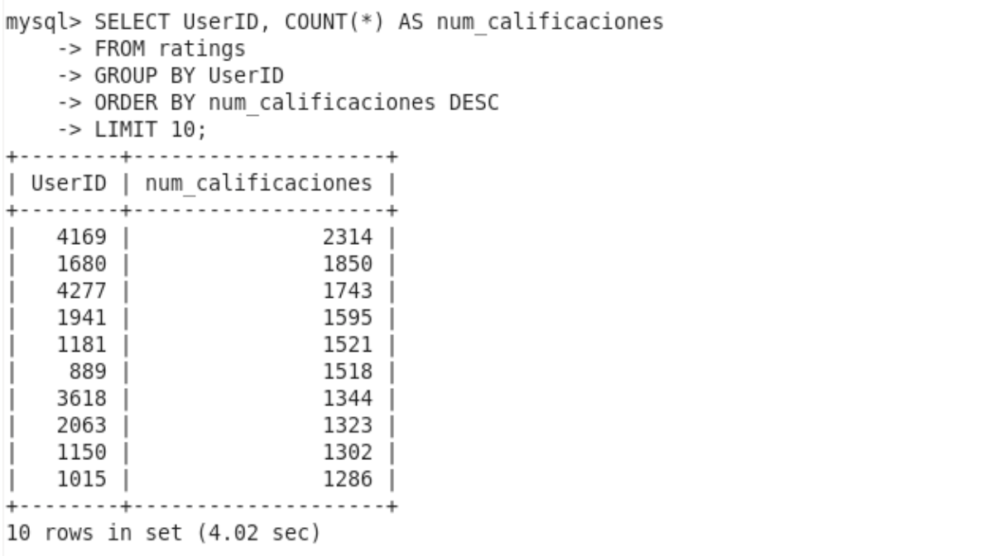
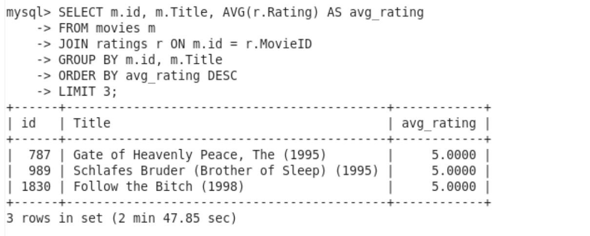
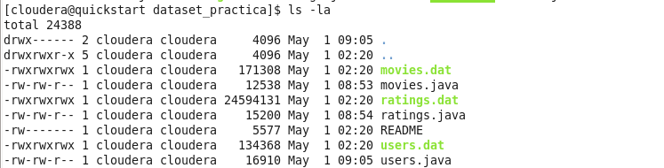
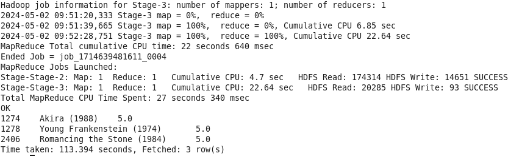
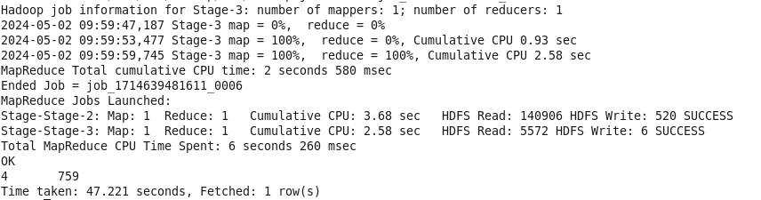

PRÁCTICA HADOOP

# EJERCICIO 1

**IMPORTACIÓN DATASETS**

1. DESCARGA DATASETS
    - Repositorio: https://github.com/dgarciaesc/sample_dataset
    - Code/Download ZIP + descomprimir

2. IMPORTACIÓN DATASETS A VIRTUALBOX/CLOUDERA
    - Con la herramienta 'File Manager' de VirtualBox desde menú 'Machine'
    > Usuario = cloudera, Password = cloudera

    

3. COMPROBAR DESCARGA Y CAMBIAR PERMISOS:
    - $ ls /home/cloudera/dh-course/sample_dataset-main/
    - $ chmod 777 movies.dat
    > cambiar en todos los datasets

    

**MSQL**

1. CREAR DATABASE + TABLAS + CARGAR DATOS:
    - $ mysql -uroot -pcloudera
    - $ show databases;
    - $ CREATE DATABASE practica_hadoop;
    - $ use practica_hadoop;

    - $ CREATE TABLE movies (MovieID INT PRIMARY KEY, Title VARCHAR(255), Genres VARCHAR(255));
    - $ LOAD DATA LOCAL INFILE '/home/cloudera/dh-course/sample_dataset-main/movies.dat'
        INTO TABLE movies
        FIELDS TERMINATED BY '::'
        LINES TERMINATED BY '\n';
    - $ select * from movies limit 5; -> Comprobar importación

    

2. CREAR RESTO DE TABLAS ('users', 'ratings' y 'occupations') + IMPORTAR DATOS:
    - $ CREATE TABLE users (UserID INT PRIMARY KEY, Gender CHAR(1), Age INT, Occupation INT, ZipCode VARCHAR(10));
    - $ LOAD DATA LOCAL INFILE '/home/cloudera/dh-course/sample_dataset-main/users.dat'
        INTO TABLE users
        FIELDS TERMINATED BY '::'
        LINES TERMINATED BY '\n';

    - $ CREATE TABLE ratings (UserID INT, MovieID INT, Rating INT, Timestamp INT,
        FOREIGN KEY (UserID) REFERENCES users(UserID),
        FOREIGN KEY (MovieID) REFERENCES movies(MovieID));
    - $ LOAD DATA LOCAL INFILE '/home/cloudera/dh-course/sample_dataset-main/ratings.dat'
        INTO TABLE ratings
        FIELDS TERMINATED BY '::'
        LINES TERMINATED BY '\n';

    - $ CREATE TABLE occupations (OccupationID INT PRIMARY KEY, OccupationName VARCHAR(255));
    - $ LOAD DATA LOCAL INFILE '/home/cloudera/dh-course/dataset_practica/occupations.dat'
        INTO TABLE occupations
        FIELDS TERMINATED BY ': '
        LINES TERMINATED BY '\n';
    - $ INSERT INTO occupations (OccupationID, OccupationName) VALUES
        (0, 'other or not specified'),
        (1, 'academic/educator'),
        (2, 'artist'),
        (3, 'clerical/admin'),
        (4, 'college/grad student'),
        (5, 'customer service'),
        (6, 'doctor/health care'),
        (7, 'executive/managerial'),
        (8, 'farmer'),
        (9, 'homemaker'),
        (10, 'K-12 student'),
        (11, 'lawyer'),
        (12, 'programmer'),
        (13, 'retired'),
        (14, 'sales/marketing'),
        (15, 'scientist'),
        (16, 'self-employed'),
        (17, 'technician/engineer'),
        (18, 'tradesman/craftsman'),
        (19, 'unemployed'),
        (20, 'writer');

**CONSULTAS MYSQL**

1. Película con más opiniones:
    - $ SELECT m.MovieID, m.Title,
        COUNT(r.MovieID) AS num_opiniones FROM movies m
        JOIN ratings r ON m.MovieID = r.MovieID
        GROUP BY m.MovieID, m.Title
        ORDER BY num_opiniones DESC LIMIT 1;

    

2. Los 10 usuarios más activos a la hora de puntuar películas:
    - $ SELECT UserID, COUNT(*) AS num_calificaciones FROM ratings
        GROUP BY UserID
        ORDER BY num_calificaciones DESC
        LIMIT 10;

    

3. Las tres mejores películas según los scores:
    - $ SELECT m.MovieID, m.Title, AVG(r.Rating) AS avg_rating FROM movies m
        JOIN ratings r ON m.MovieID = r.MovieID
        GROUP BY m.MovieID, m.Title
        ORDER BY avg_rating DESC
        LIMIT 3;
    
    

4. Profesiones en las que deberíamos enfocar nuestros esfuerzos en publicidad:
    - $ SELECT o.OccupationName, COUNT(*) AS num_calificaciones
        FROM users u
        JOIN ratings r ON u.UserID = r.UserID
        JOIN occupations o ON u.Occupation = o.OccupationID
        GROUP BY o.OccupationName
        ORDER BY num_calificaciones DESC
        LIMIT 1;

    

**SQOOP**

- IMPORTACIÓN DE MYSQL A HDFS:
    - $ sqoop import --connect jdbc:mysql://localhost/practica_hadoop
        --username root --password cloudera
        --table movies
        --warehouse-dir /hdfs-practica-hadoop

    > cambiar el nombre de cada tabla a importar si al usar 'import-all-tables' da problemas.
    > --warehouse, Sqoop crea subdirectorios dentro del directorio raíz para cada tabla importada, lo que ayuda a mantener una estructura organizada en HDFS.
    > -—num-mappers: expecificar nº si queremos mejorar rendimiento. Se crea 1 por defecto si no se especifica nada.
    > --split-by se utiliza para especificar la columna por la cual se debe dividir la importación de datos en mappers.

    - Se crearán archivos .java en la carpeta de los datasets

    

**HIVE**

- CREAR 'BASE DE DATOS' Y TABLAS:
    - $ hive
    - $ CREATE DATABASE practica_hadoop;
    - $ show databases; —> Comprobar que se ha creado
    - $ use practica_hadoop; —> Entrar en la base de datos

    - $ CREATE EXTERNAL TABLE movies (movie_id INT, title STRING, genres STRING)
        ROW FORMAT DELIMITED
        FIELDS TERMINATED BY ','
        LINES TERMINATED BY '\n'
        LOCATION '/hdfs-practica-hadoop/movies';

    - $ CREATE EXTERNAL TABLE users (user_id INT, gender STRING, age INT, occupation INT, zip_code STRING)
        ROW FORMAT DELIMITED
        FIELDS TERMINATED BY ','
        LINES TERMINATED BY '\n'
        LOCATION ‘/hdfs-practica-hadoop/users';

    - $ CREATE EXTERNAL TABLE ratings (RatingID INT, MovieID INT, rating INT, timestamp INT)
        FOREIGN KEY (RatingID) REFERENCES users(UserID)
        FOREIGN KEY (MovieID) REFERENCES movies(MovieID)
        ROW FORMAT DELIMITED
        FIELDS TERMINATED BY ','
        LINES TERMINATED BY '\n'
        LOCATION '/hdfs-practica-hadoop/ratings';

**CONSULTAS HIVE**

1. Película con más opiniones:
    - $ SELECT m.movie_id, m.Title, COUNT(r.movie_id) AS num_opiniones
        FROM movies m
        JOIN ratings r ON m.movie_id = r.movie_id
        GROUP BY m.movie_id, m.title
        ORDER BY num_opiniones DESC
        LIMIT 1;

2. Los 10 usuarios más activos a la hora de puntuar películas:
    - $ SELECT user_id, COUNT(*) AS num_calificaciones FROM ratings
        GROUP BY user_id
        ORDER BY num_calificaciones DESC
        LIMIT 10;

3. Las tres mejores películas según los scores:
    - $ SELECT m.movie_id, m.title, AVG(r.rating) AS avg_rating FROM movies m
        JOIN ratings r ON m.movie_id = r.movie_id
        GROUP BY m.movie_id, m.title
        ORDER BY avg_rating DESC
        LIMIT 3;

    

4. Profesiones en las que deberíamos enfocar nuestros esfuerzos en publicidad:
    - $ SELECT u.occupation, COUNT(*) AS num_calificaciones FROM users u
        JOIN ratings r ON u.user_id = r.user_id
        GROUP BY u.occupation
        ORDER BY num_calificaciones DESC
        LIMIT 1;
    
    

    > 4 corresponde a: "college/grad student"
    **Se debería crear una 4ª tabla de ‘Occupation’ con ID y descripción relacionada con la tabla ‘users’**

5. Otros insight valioso que pudiéramos extraer de los datos procesados:

    - Tendencias de género:
    analizar las preferencias de género de los usuarios para diferentes tipos de películas calculando el promedio de calificaciones para películas de distintos géneros y comparar cómo difieren las preferencias entre hombres y mujeres.

    - Análisis temporal:
    investigar cómo ha evolucionado el comportamiento de los usuarios con el tiempo analizando si hay tendencias estacionales en la cantidad de calificaciones o en los géneros de películas más populares en diferentes momentos del año.

    - Análisis de la participación del usuario:
    examinar la frecuencia con la que los usuarios califican películas y si hay algún patrón en la participación de los usuarios según su edad, género u ocupación.

    - Identificación de películas subvaloradas o sobrevaloradas:
    identificar películas que han recibido calificaciones significativamente más altas o más bajas de lo esperado en función de las calificaciones promedio de otras películas similares.

    - Recomendaciones de películas:
    Utilizando algoritmos de recomendación, desarrollar un sistema de recomendación que sugiera películas a los usuarios en función de sus calificaciones anteriores y de las calificaciones de usuarios similares.