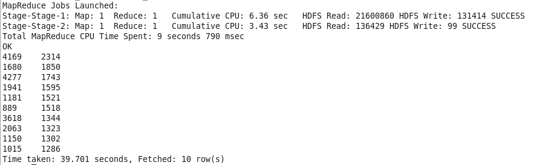
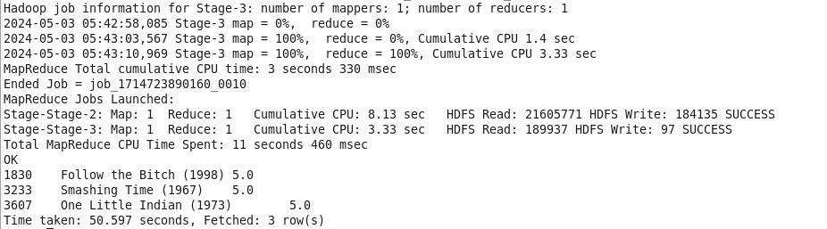

**EJERCICIO 1.1**

- Usar File Manager para importar dataset 'sample_dataset-main' al entorno Cloudera (en la carpeta 'cloudera')
- Cargamos datasets en HDFS dentro de la carpeta 'films':
$ hadoop fs -put /home/cloudera/sample_dataset-main /user/cloudera/films
$ hdfs dfs -ls films
Cambiar permisos:
$ hdfs dfs -chmod 777 /user/cloudera/films/movies.dat
$ hdfs dfs -chmod 777 /user/cloudera/films/ratings.dat
$ hdfs dfs -chmod 777 /user/cloudera/films/users.dat

Prepocesamiento de datos (cambiamos '::' por '|'):
$ hdfs dfs -cat /user/cloudera/films/movies.dat | sed 's/::/\t/g' | hdfs dfs -put -f - /user/cloudera/films/movies_modified.dat
$ hdfs dfs -cat /user/cloudera/films/users.dat | sed 's/::/|/g' | hdfs dfs -put -f - /user/cloudera/films/users_modified.dat
$ hdfs dfs -cat /user/cloudera/films/ratings.dat | sed 's/::/|/g' | hdfs dfs -put -f - /user/cloudera/films/ratings_modified.dat

Cambio de permisos:
$ hdfs dfs -chmod 777 /user/cloudera/films/users_modified.dat

Cargamos a Hive:
> Creamos tablas en hive:
$ hive
$ create database movies;
$ use movies;

$ CREATE EXTERNAL TABLE movies (MovieID INT, Title STRING, Genres STRING)
    ROW FORMAT DELIMITED
    FIELDS TERMINATED BY '\t'
    LINES TERMINATED BY '\n';

$ CREATE EXTERNAL TABLE users (UserID INT, Gender STRING, Age INT, Occupation INT, zip_code INT)
    ROW FORMAT DELIMITED
    FIELDS TERMINATED BY '|'
    LINES TERMINATED BY '\n';

$ CREATE EXTERNAL TABLE ratings (UserID INT, MovieID INT, Rating INT, Timestamp INT)
    ROW FORMAT DELIMITED
    FIELDS TERMINATED BY '|'
    LINES TERMINATED BY '\n';

$ CREATE EXTERNAL TABLE occupations (OccupationID INT, OccupationName STRING);

> Otra forma de crear las tablas sin hacer preprocesado es al crear las tablas en HIVE, añadir:
    ROW FORMAT SERDE 'org.apache.hadoop.hive.contrib.serde2.MultiDelimitSerDe' 
    WITH SERDEPROPERTIES ("field.delim"="::")

Cargamos los datos:
$ LOAD DATA INPATH '/user/cloudera/films/movies_modified.dat' INTO TABLE movies;
$ LOAD DATA INPATH '/user/cloudera/films/users_modified.dat' INTO TABLE users;
$ LOAD DATA INPATH '/user/cloudera/films/ratings_modified.dat' INTO TABLE ratings;
$ INSERT INTO occupations VALUES
    (0, 'other or not specified'),
    (1, 'academic/educator'),
    (2, 'artist'),
    (3, 'clerical/admin'),
    (4, 'college/grad student'),
    (5, 'customer service'),
    (6, 'doctor/health care'),
    (7, 'executive/managerial'),
    (8, 'farmer'),
    (9, 'homemaker'),
    (10, 'K-12 student'),
    (11, 'lawyer'),
    (12, 'programmer'),
    (13, 'retired'),
    (14, 'sales/marketing'),
    (15, 'scientist'),
    (16, 'self-employed'),
    (17, 'technician/engineer'),
    (18, 'tradesman/craftsman'),
    (19, 'unemployed'),
    (20, 'writer');

> Si al cargar los datos aparecen varias filas con valores 'null', volver a prepocesar y sobreescribir los datos con:
    $ LOAD DATA INPATH '/user/cloudera/films/dataset_modified.dat' OVERWRITE INTO TABLE tabla;

**CONSULTAS HIVE**

1. Película con más opiniones:
    - $ SELECT m.MovieID, m.Title,
        COUNT(r.MovieID) AS num_opiniones FROM movies m
        JOIN ratings r ON m.MovieID = r.MovieID
        GROUP BY m.MovieID, m.Title
        ORDER BY num_opiniones DESC LIMIT 1;

    

2. Los 10 usuarios más activos a la hora de puntuar películas:
    - $ SELECT UserID, COUNT(*) AS num_calificaciones FROM ratings
        GROUP BY UserID
        ORDER BY num_calificaciones DESC
        LIMIT 10;

    

3. Las tres mejores películas según los scores:
    - $ SELECT m.MovieID, m.Title, AVG(r.Rating) AS avg_rating FROM movies m
        JOIN ratings r ON m.MovieID = r.MovieID
        GROUP BY m.MovieID, m.Title
        ORDER BY avg_rating DESC
        LIMIT 3;

    

4. Profesiones en las que deberíamos enfocar nuestros esfuerzos en publicidad:
    - Profesión que más calificaciones hace:
    - $ SELECT o.OccupationName, COUNT(*) AS num_calificaciones
        FROM users u
        JOIN ratings r ON u.UserID = r.UserID
        JOIN occupations o ON u.Occupation = o.OccupationID
        GROUP BY o.OccupationName
        ORDER BY num_calificaciones DESC
        LIMIT 1;
    
    

5. Otros insight valiosos que pudiéramos extraer de los datos procesados:

    - Analisis de las preferencias de género cinematográfico de los usuarios calculando el promedio de calificaciones de los distintos géneros y cómo difieren las preferencias entre hombres y mujeres.

        - $ SELECT m.Genres,
            AVG(CASE WHEN u.Gender = 'M' THEN r.Rating END) AS Male_Average_Rating,
            AVG(CASE WHEN u.Gender = 'F' THEN r.Rating END) AS Female_Average_Rating
            FROM ratings r JOIN movies m ON r.MovieID = m.MovieID
            JOIN users u ON r.UserID = u.UserID
            GROUP BY m.Genres;

        

        - El género con mayor rating en hombres y en mujeres:
        - $ SELECT m.Genres,
                AVG(CASE WHEN u.Gender = 'M' THEN r.Rating END) AS Male_Average_Rating,
                AVG(CASE WHEN u.Gender = 'F' THEN r.Rating END) AS Female_Average_Rating
            FROM ratings r
            JOIN movies m ON r.MovieID = m.MovieID
            JOIN users u ON r.UserID = u.UserID
            GROUP BY m.Genres
            ORDER BY Male_Average_Rating DESC, Female_Average_Rating DESC
            LIMIT 1;

        

    **HUE**

    > Las consultas en Hive también pueden realizarse con la interfaz gráfica de Haddop 'HUE' para se vean mejor.
    
    - Análisis del comportamiento de los usuarios analizando si hay tendencias estacionales en la cantidad de calificaciones en diferentes momentos del año.

        - $ SELECT MONTH(FROM_UNIXTIME(r.Timestamp)) AS Month,
            YEAR(FROM_UNIXTIME(r.Timestamp)) AS Year,
            COUNT(*) AS Total_Ratings,
            AVG(r.Rating) AS Average_Rating FROM ratings r
            GROUP BY MONTH(FROM_UNIXTIME(r.Timestamp)), YEAR(FROM_UNIXTIME(r.Timestamp))
            ORDER BY Year, Month;

        
        
        > El mes con más calificaciones realizadas fue noviembre del año 2.000 con 291.012 y una media de 3,57. El que menos, octubre del 2002 con 1.016 y una media de 3,55.

    - Análisis de la participación del usuario mediante el número total de calificaciones y el promedio de calificaciones para cada grupo de edad, género y ocupación.

        - $ SELECT u.Age AS Age_Group, u.Gender AS Gender, o.OccupationName AS Occupation,
            COUNT(*) AS Total_Ratings,
            AVG(r.Rating) AS Average_Rating
            FROM ratings r JOIN users u ON r.UserID = u.UserID JOIN occupations o ON u.Occupation = o.OccupationID
            GROUP BY u.Age, u.Gender, o.OccupationName
            ORDER BY Total_Ratings DESC;

        

        > El grupo de edad que realiza más calificaciones son hombres entre 18 y 24 años con una ocupación de 'estudiantes' con 65.676 calificaciones. Los que menos, las mujeres entre 25 y 34 años con una ocupación de 'científica' con 2.536 calificaciones.

**EJERCICIO 1.2**

sqoop export \
--connect jdbc:mysql://localhost/movies \
--username root \
--password cloudera \
--table movies \
--export-dir /user/hive/warehouse/movies.db \
--input-fields-terminated-by '\t' \
--input-lines-terminated-by '\n';

- $ sqoop import-all-tables --connect jdbc:mysql://localhost/practica_hadoop --username root --password cloudera --table movies --warehouse-dir /hdfs-practica-hadoop

sqoop import --connect jdbc:mysql://localhost/practica_hadoop --username root --password cloudera --target-dir /films --table movies --fields-terminated-by '::' --lines-terminated-by '\n' --hive-import --hive-table movies

sqoop export --connect jdbc:mysql://localhost/movies --username root --password cloudera --target-dir /home/cloudera/films --table movies --fields-terminated-by '\t' --lines-terminated-by '\n' --hive-import --hive-table movies

> Carga los datos en el la base de datos 'default'

sqoop export --connect jdbc:mysql://localhost/exercise1 --username root --password cloudera --table result_table --export-dir /user/hive/warehouse/practica.db/result_table --input-fields-terminated-by ',' 

> hive: $dfs -ls /user/hive/warehouse/