**EJERCICIO 1.1**

- Usar File Manager para importar dataset 'sample_dataset-main' al entorno Cloudera (en la carpeta 'cloudera') en /home/cloudera
- Creación tablas en hive:
    $ hive
    $ create database films;
    $ use films;
    $ CREATE EXTERNAL TABLE movies (MovieID INT, Title STRING, Genres STRING)
        ROW FORMAT SERDE 'org.apache.hadoop.hive.contrib.serde2.MultiDelimitSerDe' 
        WITH SERDEPROPERTIES ("field.delim"="::");

    $ CREATE EXTERNAL TABLE users (UserID INT, Gender STRING, Age INT, Occupation INT, zip_code INT)
        ROW FORMAT SERDE 'org.apache.hadoop.hive.contrib.serde2.MultiDelimitSerDe' 
        WITH SERDEPROPERTIES ("field.delim"="::");

    $ CREATE EXTERNAL TABLE ratings (UserID INT, MovieID INT, Rating INT, Timestamp INT)
        ROW FORMAT SERDE 'org.apache.hadoop.hive.contrib.serde2.MultiDelimitSerDe' 
        WITH SERDEPROPERTIES ("field.delim"="::");

    > usamos 'SERDE' con el delimitador "::" porque los datasets tienen los campos separados por "::"
    > si no funcionase 'SERDE' se puede prepocesar los datos cambiando '::' por '\t' y usar el archivo modificado para cargar los datos:
        $ hdfs dfs -cat /ruta-dataset/movies.dat | sed 's/::/\t/g' | hdfs dfs -put -f - /ruta-dataset/movies_modified.dat
        - en hive crearíamos las tablas así:
            $ CREATE EXTERNAL TABLE movies (MovieID INT, Title STRING, Genres STRING)
                ROW FORMAT DELIMITED
                FIELDS TERMINATED BY '\t'
                LINES TERMINATED BY '\n';

    - Creamos la tabla 'Occupations' para que aparezca en las consultas la ocupación en vez de un nº:
    $ CREATE EXTERNAL TABLE occupations (OccupationID INT, OccupationName STRING);
    $ INSERT INTO occupations VALUES
    (0, 'other or not specified'),
    (1, 'academic/educator'),
    (2, 'artist'),
    (3, 'clerical/admin'),
    (4, 'college/grad student'),
    (5, 'customer service'),
    (6, 'doctor/health care'),
    (7, 'executive/managerial'),
    (8, 'farmer'),
    (9, 'homemaker'),
    (10, 'K-12 student'),
    (11, 'lawyer'),
    (12, 'programmer'),
    (13, 'retired'),
    (14, 'sales/marketing'),
    (15, 'scientist'),
    (16, 'self-employed'),
    (17, 'technician/engineer'),
    (18, 'tradesman/craftsman'),
    (19, 'unemployed'),
    (20, 'writer');

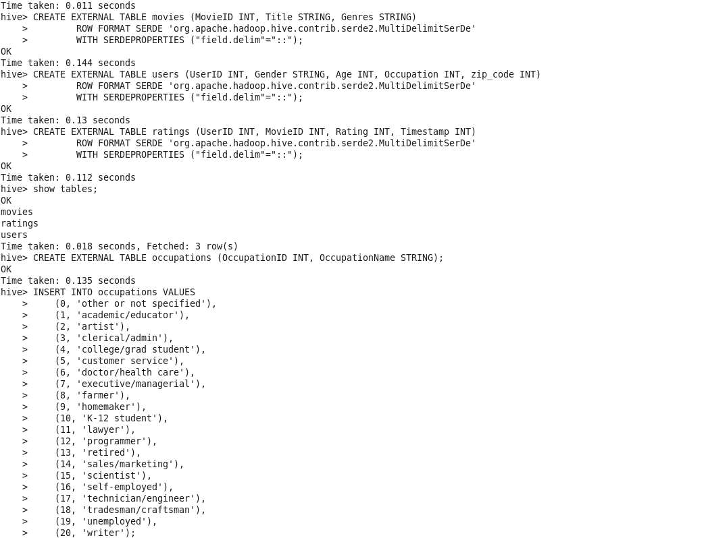

- Carga de los datos en las tablas 'movies', 'users' y 'ratings' de Hive desde HDFS:
    $ hadoop fs -put /home/cloudera/sample_dataset-main/movies.dat /user/hive/warehouse/films.db/movies
    $ hadoop fs -put /home/cloudera/sample_dataset-main/users.dat /user/hive/warehouse/films.db/users
    $ hadoop fs -put /home/cloudera/sample_dataset-main/ratings.dat /user/hive/warehouse/films.db/ratings

> También podrían cargarse los datos con:
    $ hadoop fs -put /home/cloudera/sample_dataset-main /user/cloudera/films
    $ LOAD DATA INPATH '/user/cloudera/films/movies.dat' INTO TABLE movies;

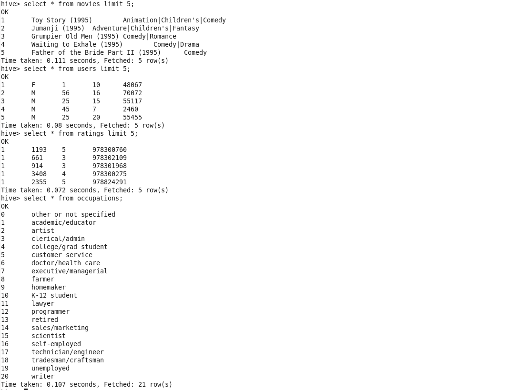

**CONSULTAS HIVE**

1. Película con más opiniones:
    - $ SELECT m.MovieID, m.Title,
        COUNT(r.MovieID) AS num_opiniones FROM movies m
        JOIN ratings r ON m.MovieID = r.MovieID
        GROUP BY m.MovieID, m.Title
        ORDER BY num_opiniones DESC LIMIT 1;

    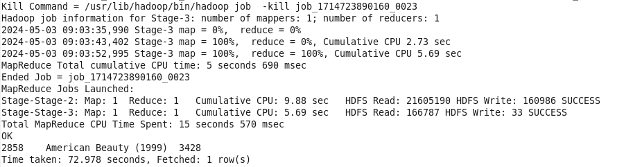

2. Los 10 usuarios más activos a la hora de puntuar películas:
    - $ SELECT UserID, COUNT(*) AS num_calificaciones FROM ratings
        GROUP BY UserID
        ORDER BY num_calificaciones DESC
        LIMIT 10;

    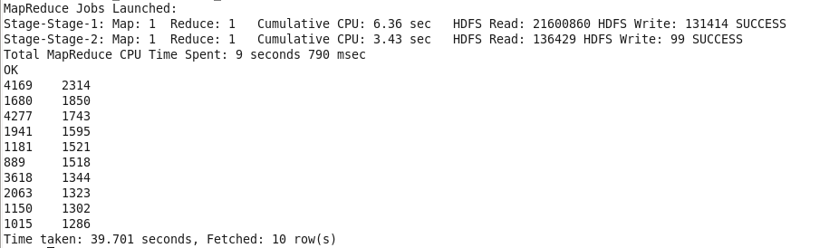

3. Las tres mejores películas según los scores:
    - $ SELECT m.MovieID, m.Title, AVG(r.Rating) AS avg_rating FROM movies m
        JOIN ratings r ON m.MovieID = r.MovieID
        GROUP BY m.MovieID, m.Title
        ORDER BY avg_rating DESC
        LIMIT 3;

    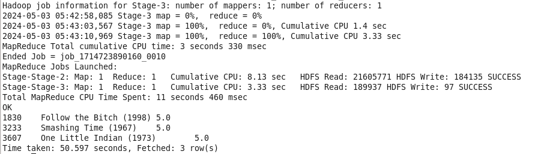

4. Profesiones en las que deberíamos enfocar nuestros esfuerzos en publicidad por ser la que menos calificaciones hace:
    - $ SELECT o.OccupationName, COUNT(*) AS num_calificaciones
        FROM users u
        JOIN ratings r ON u.UserID = r.UserID
        JOIN occupations o ON u.Occupation = o.OccupationID
        GROUP BY o.OccupationName
        ORDER BY num_calificaciones ASC
        LIMIT 1;
    
    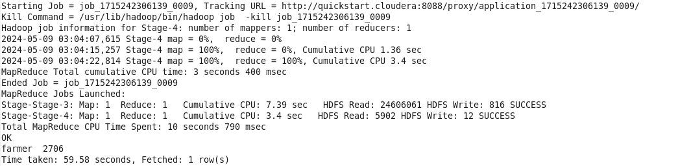

    > Las personas con ocupación de 'farmer' es la que menos calificaciones hace.

5. Otros insight valiosos que pudiéramos extraer de los datos procesados:

    - Analisis de las preferencias de género cinematográfico de los usuarios calculando el promedio de calificaciones de los distintos géneros y cómo difieren las preferencias entre hombres y mujeres:
        - $ SELECT m.Genres,
            AVG(CASE WHEN u.Gender = 'M' THEN r.Rating END) AS Male_Average_Rating,
            AVG(CASE WHEN u.Gender = 'F' THEN r.Rating END) AS Female_Average_Rating
            FROM ratings r JOIN movies m ON r.MovieID = m.MovieID
            JOIN users u ON r.UserID = u.UserID
            GROUP BY m.Genres;

        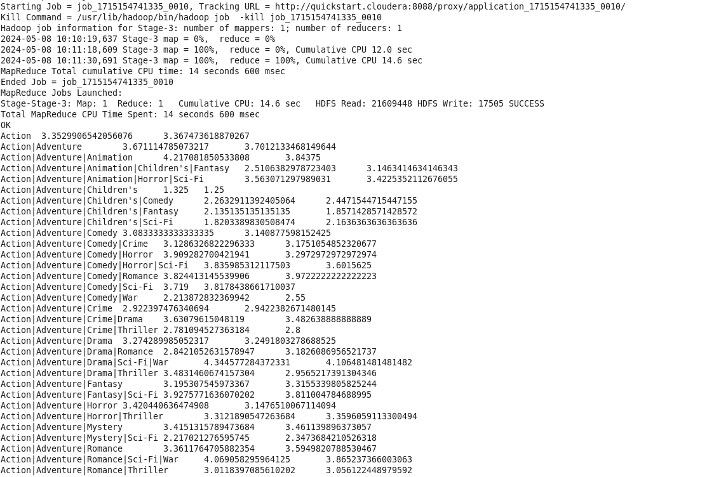

    - El género con mayor rating en hombres y en mujeres:
        - $ SELECT m.Genres,
                AVG(CASE WHEN u.Gender = 'M' THEN r.Rating END) AS Male_Average_Rating,
                AVG(CASE WHEN u.Gender = 'F' THEN r.Rating END) AS Female_Average_Rating
            FROM ratings r
            JOIN movies m ON r.MovieID = m.MovieID
            JOIN users u ON r.UserID = u.UserID
            GROUP BY m.Genres
            ORDER BY Male_Average_Rating DESC, Female_Average_Rating DESC
            LIMIT 1;

        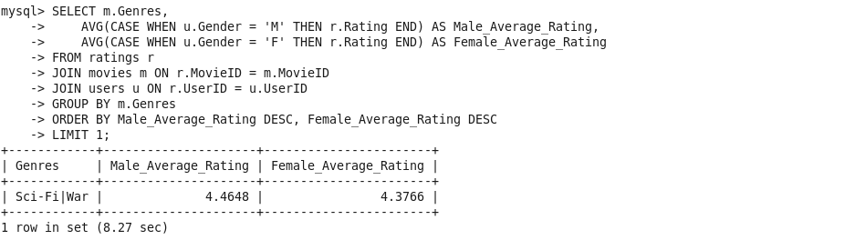

    > El género con mayor rating en hombres y mujeres es 'Sci | War' (4,46 y 4,3 respectivamente)

    **HUE**

    > Las consultas en Hive también pueden realizarse con la interfaz gráfica de Haddop 'HUE' para se vean mejor.

    - Análisis del comportamiento de los usuarios analizando si hay tendencias estacionales en la cantidad de calificaciones en diferentes momentos del año.

        - $ SELECT MONTH(FROM_UNIXTIME(r.Timestamp)) AS Month,
            YEAR(FROM_UNIXTIME(r.Timestamp)) AS Year,
            COUNT(*) AS Total_Ratings,
            AVG(r.Rating) AS Average_Rating FROM ratings r
            GROUP BY MONTH(FROM_UNIXTIME(r.Timestamp)), YEAR(FROM_UNIXTIME(r.Timestamp))
            ORDER BY Year, Month;

        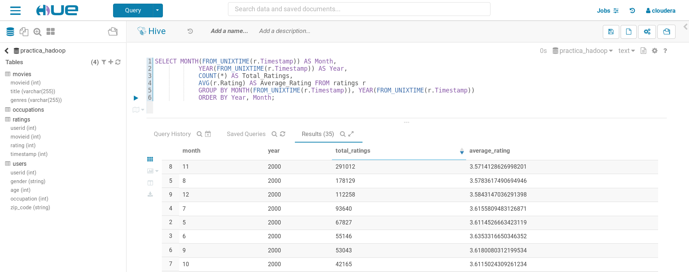
        
        > El mes con más calificaciones realizadas fue noviembre del año 2.000 con 291.012 y una media de 3,57. El que menos, octubre del 2002 con 1.016 y una media de 3,55.

    - Análisis de la participación del usuario mediante el número total de calificaciones y el promedio de calificaciones para cada grupo de edad, género y ocupación.

        - $ SELECT u.Age AS Age_Group, u.Gender AS Gender, o.OccupationName AS Occupation,
            COUNT(*) AS Total_Ratings,
            AVG(r.Rating) AS Average_Rating
            FROM ratings r JOIN users u ON r.UserID = u.UserID JOIN occupations o ON u.Occupation = o.OccupationID
            GROUP BY u.Age, u.Gender, o.OccupationName
            ORDER BY Total_Ratings DESC;

        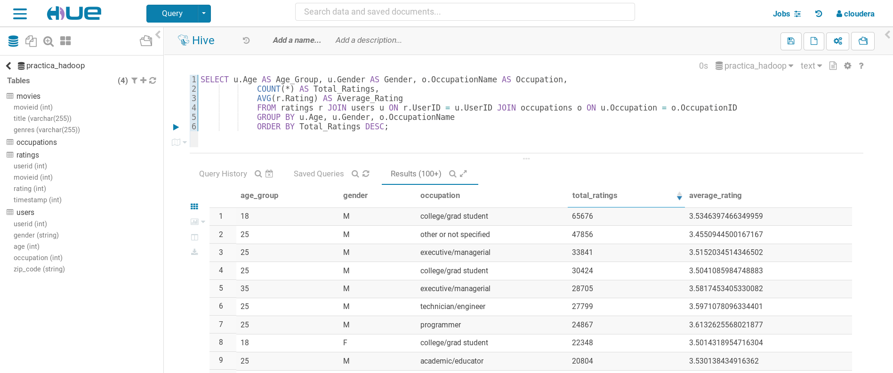

        > El grupo de edad que realiza más calificaciones son hombres entre 18 y 24 años con una ocupación de 'estudiantes' con 65.676 calificaciones. Los que menos, las mujeres entre 25 y 34 años con una ocupación de 'científica' con 2.536 calificaciones.

**EJERCICIO 1.2**

- Crear base de datos 'movies' y tablas en mysql:
    $ mysql -uroot -pcloudera
    $ CREATE DATABASE films;
    $ show databases;
    $ use films;
    $ CREATE TABLE movies (MovieID INT PRIMARY KEY, Title VARCHAR(255), Genres VARCHAR(255));
    $ CREATE TABLE users (UserID INT PRIMARY KEY, Gender CHAR(1), Age INT, Occupation INT, ZipCode VARCHAR(10));
    $ CREATE TABLE ratings (UserID INT, MovieID INT, Rating INT, Timestamp INT,
        FOREIGN KEY (UserID) REFERENCES users(UserID),
        FOREIGN KEY (MovieID) REFERENCES movies(MovieID));
    $ CREATE TABLE occupations (OccupationID INT PRIMARY KEY, OccupationName VARCHAR(255));
    $ INSERT INTO occupations (OccupationID, OccupationName) VALUES
        (0, 'other or not specified'),
        (1, 'academic/educator'),
        (2, 'artist'),
        (3, 'clerical/admin'),
        (4, 'college/grad student'),
        (5, 'customer service'),
        (6, 'doctor/health care'),
        (7, 'executive/managerial'),
        (8, 'farmer'),
        (9, 'homemaker'),
        (10, 'K-12 student'),
        (11, 'lawyer'),
        (12, 'programmer'),
        (13, 'retired'),
        (14, 'sales/marketing'),
        (15, 'scientist'),
        (16, 'self-employed'),
        (17, 'technician/engineer'),
        (18, 'tradesman/craftsman'),
        (19, 'unemployed'),
        (20, 'writer');

- Prepocesado de datos (cambiar '::' a una tabulación para que Mysql lo lea correctamente al exportar con Sqoop):
    $ hdfs dfs -cat /user/hive/warehouse/films.db/movies/movies.dat | sed 's/::/\t/g' | hdfs dfs -put -f - /user/hive/warehouse/films.db/movies/movies_modified/movies_modified.dat
    $ hdfs dfs -cat /user/hive/warehouse/films.db/users/users.dat | sed 's/::/\t/g' | hdfs dfs -put -f - /user/hive/warehouse/films.db/users/users_modified/users_modified.dat
    $ hdfs dfs -cat /user/hive/warehouse/films.db/ratings/ratings.dat | sed 's/::/\t/g' | hdfs dfs -put -f - /user/hive/warehouse/films.db/ratings/ratings_modified/ratings_modified.dat

- Importar tablas y datos a myslq desde hive con HDFS (export-all-tables da problemas):
    $ sqoop export \
    --connect jdbc:mysql://quickstart.cloudera/movies --username root --password cloudera \
    --table movies \
    --export-dir /user/hive/warehouse/films.db/movies/movies_modified \
    --input-fields-terminated-by "\t" \
    --input-lines-terminated-by "\n"

    $ sqoop export \
    --connect jdbc:mysql://quickstart.cloudera/movies --username root --password cloudera \
    --table users \
    --export-dir /user/hive/warehouse/films.db/users/users_modified \
    --input-fields-terminated-by "\t" \
    --input-lines-terminated-by "\n"

    $ sqoop export \
    --connect jdbc:mysql://quickstart.cloudera/movies --username root --password cloudera \
    --table ratings \
    --export-dir /user/hive/warehouse/films.db/ratings/ratings_modified \
    --input-fields-terminated-by "\t" \
    --input-lines-terminated-by "\n"

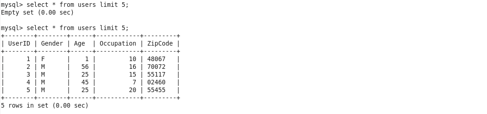

**CONSULTAS MYSQL**

1. Película con más opiniones:
    - $ SELECT m.MovieID, m.Title,
        COUNT(r.MovieID) AS num_opiniones FROM movies m
        JOIN ratings r ON m.MovieID = r.MovieID
        GROUP BY m.MovieID, m.Title
        ORDER BY num_opiniones DESC LIMIT 1;

    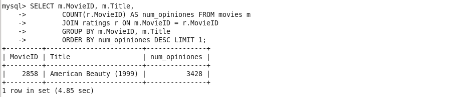

2. Los 10 usuarios más activos a la hora de puntuar películas:
    - $ SELECT UserID, COUNT(*) AS num_calificaciones FROM ratings
        GROUP BY UserID
        ORDER BY num_calificaciones DESC
        LIMIT 10;

    

3. Las tres mejores películas según las calificaciones:
    - $ SELECT m.MovieID, m.Title, AVG(r.Rating) AS avg_rating FROM movies m
        JOIN ratings r ON m.MovieID = r.MovieID
        GROUP BY m.MovieID, m.Title
        ORDER BY avg_rating DESC
        LIMIT 3;
    
    

4. Profesiones en las que deberíamos enfocar nuestros esfuerzos en publicidad:
    - Profesión que más calificaciones hace:
    - $ SELECT o.OccupationName, COUNT(*) AS num_calificaciones
        FROM users u
        JOIN ratings r ON u.UserID = r.UserID
        JOIN occupations o ON u.Occupation = o.OccupationID
        GROUP BY o.OccupationName
        ORDER BY num_calificaciones DESC
        LIMIT 1;

    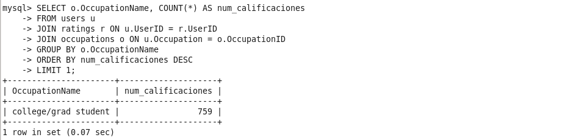